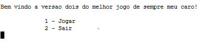
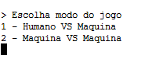
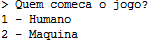
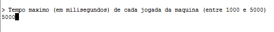
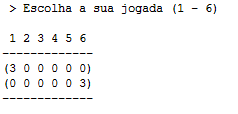
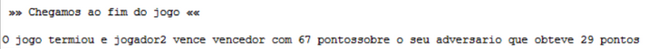

Manual de Utilizador
=====

*TIAGO ANDRÉ MENDES DE ALMEIDA RIBEIRO*

*TIAGO ALEXANDRE QUARESMA ALVES*

Índice
=====
- Introdução
- Instalação
- Implementação técnica

Introdução
=====
Este documento é um guia de como utilizar a aplicação desenvolvida em lisp no âmbito do projeto de Inteligência Artificial
A aplicação é um jogo de estratégia da família dos jogos de tabuleiro Mancala, que hoje em dia ainda têm uma grande popularidade. 
Nesta versão do jogo Adji‒boto*, existe um tabuleiro com 2 linhas e 6 buracos em cada linha e é iniciado com 8 peças em cada buraco cada jogador fica com uma das linhas de buracos
- As jogadas são feitas à vez e, em cada turno, um jogador retira todas as peças de um dos buracos da sua linha e vai depositando cada uma dessas peças retiradas no buraco adjacente e em cada um dos buracos seguintes, no sentido contrário ao dos ponteiros do relógio;
- Quando ao depositar uma peça em cada buraco seguinte, se chegar ao buraco em que inicialmente se retirou as peças (foi efetuada uma volta completa), deve‒se saltar essa casa colocando a(s) peça(s) que ainda sobra(m) na(s) casa(s)seguinte(s);
- Se a jogada acabar numa casa da linha do tabuleiro contrária aquela em que estavam inicialmente as peças, ficando na casa final 1, 3 ou 5 peças, essas peças podem ser “capturadas”, sendo retiradas do tabuleiro.
O projeto implementado visa implementar os algoritmos **Minimax** com **cortes Alfa Beta** para a resolução autónoma dos jogos.
- *Minimax*: Algoritmo de decisão que determina qual é o melhor outcome de nó avaliando qual seria o pior para o adversário.
- *Alfa Beta*: Algoritmo de procura com o objetivo de diminuir o número de nós procurados, fornecidos pelo algoritmo de minimax. 

Instalação 
=====
Para a aplicação correr é necessário no que no ficheiro interact.lisp, se indique o caminho onde o projeto se encontra na função get-curr-dir.
- Exemplo windows: C:/Users/${user}/Documents/projeto
- Exemplo Mac: /Users/${user}/Documents/projeto

Implementação técnica
=====
O jogo começa por ser chamar a função (start-game), a mesma vai carregar as dependências necessárias e dar início ao jogo apresentando o menu de jogo.
Para escolher uma opção do menu é necessário introduzir o número da opção e carregar no Enter, e é levado para o menu que escolheu.

Em seguida escolhe o Modo de Jogo e a ordem de jogada:

Qual o tempo de cada jogada da máquina

Com estas informações é iniciado o jogo.
Na vez do humano é lhe apresentado o tabuleiro e é lhe pedido a casa onde quer jogar

Quando é a vez da máquina é somente apresentado a casa onde a máquina jogou e as estatísticas da jogada.

No final do jogo é lhe apresentado quem venceu e com quantos pontes de diferença.

